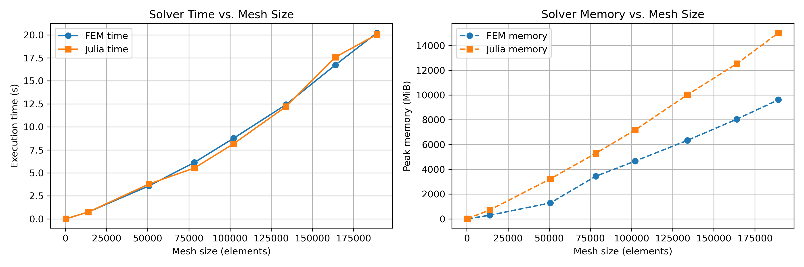

# FEM vs Gridap: Stokes Flow in a Wavy Channel

This repository benchmarks two finite element solvers for the 2D incompressible Stokes equations in a wavy-walled channel geometry. The solvers are:

- **FreeFEM** using Taylor–Hood elements (P2–P1)
- **Julia/Gridap** using equivalent elements

Both implementations solve the same problem on identical meshes and are compared in terms of:
- Execution time
- Peak memory usage

---

## 🔧 Problem Setup

The domain is a 2D channel with sinusoidal upper and lower boundaries:
``y = ±A·sin(2πx / L)``

Boundary conditions:
- No-slip on walls
- Prescribed pressure at inlet and outlet

---

## 🧪 Files in the Repository

| File Name                 | Description                                         |
|--------------------------|-----------------------------------------------------|
| `stokes.edp`             | FreeFEM script                                      |
| `stokes1.jl`             | Julia/Gridap script                                 |
| `wavy.geo`               | Gmsh geometry file                                  |
| `wavy.msh`               | Gmsh-generated mesh                                 |
| `data.ipynb`             | Python notebook for timing/memory plots             |
| `first.png`              | Combined plot of execution time and memory          |
| `timing_vs_mesh.png`     | Execution time vs mesh size                         |
| `memory_vs_mesh.png`     | Peak memory usage vs mesh size                      |
| `performance_comparison.png` | Summary plot comparing both solvers             |
| `report.pdf`             | PDF report of the study                             |

---

## 📊 Results

- **Execution Time**: Both solvers scale nearly linearly with mesh size.
- **Memory Usage**: Julia/Gridap uses more memory than FreeFEM—approximately 10x for large meshes.

---

## 📝 Observations

- 🟦 **FreeFEM**
  - Simple domain-specific syntax
  - ~35 lines of code
  - Quick prototyping (under 30 min)
  - Less memory consumption

- 🟧 **Julia/Gridap**
  - Longer code (~70 lines)
  - Composable & GPU-friendly ecosystem
  - More memory-hungry
  - Better suited for advanced research tasks

---

## 📂 Reproducibility

You can reproduce the results using the files provided here. Make sure you have:

- Gmsh
- FreeFEM
- Julia with Gridap.jl and GridapGmsh.jl
- Python with matplotlib (for plots)

---

## 📜 License

MIT License © 2025 Alireza Khademiyan
